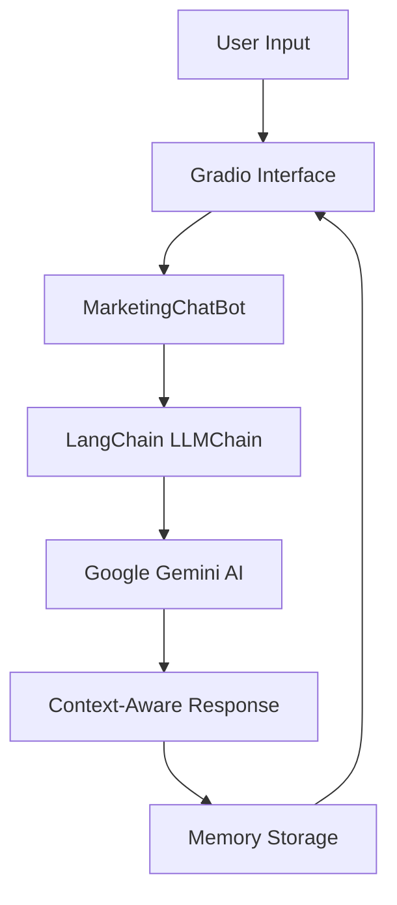

# 🎯 Marketing Analytics Chatbot

**An intelligent AI-powered chatbot that helps marketers analyze campaign performance and extract data-driven insights from marketing metrics.**

## 📋 Prerequisites

- Python 3.8 or higher
- Google Gemini API key ([Get it here](https://aistudio.google.com/))

## 🚀 Quick Installation

### 1. Create Project Directory
```bash
mkdir marketing-chatbot
cd marketing-chatbot
```
### 2. Set Up Virtual Environment
```bash
python -m venv venv

# Activate on Mac/Linux:
source venv/bin/activate

# Activate on Windows:
venv\Scripts\activate
```
### 3. Install Dependencies
```bash
pip install -r requirements.txt
```
### 4. Configure Environment
- Create a .env file:
```env
GEMINI_API_KEY=your_actual_gemini_api_key_here
```
### 5. Running the Application
- Save the Code
```bash
python <filename>
```
### Access the interface
- The terminal will display a local URL (typically http://127.0.0.1:7860)
- Open this URL in your web browser
- Start chatting with the marketing analytics assistant!



## 🔧 Core Components

### 1. **AI Model Setup**
- Uses Google's Gemini 2.5 Flash AI model
- Configures temperature (0.7) for balanced responses
- Loads API key from environment variables

### 2. **Memory Management**
- `ConversationBufferMemory` stores chat history
- Maintains context across multiple conversations
- Preserves previous questions and answers

### 3. **Marketing Data Structure**
- Pre-loaded with sample marketing metrics:
  - Email open rates, click-through rates
  - Conversion rates, social media engagement
  - Campaign budgets and ROI data
- Organized by time periods (last quarter, holiday season, Q1)

### 4. **Prompt Engineering**
- Custom template that includes:
  - Marketing data context
  - Conversation history
  - Current user question
- Structured to provide data-driven marketing insights

### 5. **Web Interface (Gradio)**
- Clean chat interface with example questions
- Real-time conversation display
- Copy functionality and session management
- Responsive design with custom CSS

## ⚡ Key Features

- **Context-Aware Responses**: Uses conversation history for follow-up questions
- **Data Integration**: Automatically includes marketing metrics in prompts
- **Error Handling**: Graceful error management for API issues
- **User-Friendly UI**: Simple web interface accessible via browser

## 📊 What It Does

The chatbot acts as a marketing analyst assistant that can:
- Analyze campaign performance metrics
- Compare data across different time periods
- Provide insights based on historical data
- Answer follow-up questions with context
- Suggest marketing strategy improvements

The system combines AI reasoning with structured marketing data to deliver actionable business insights through natural conversation.

