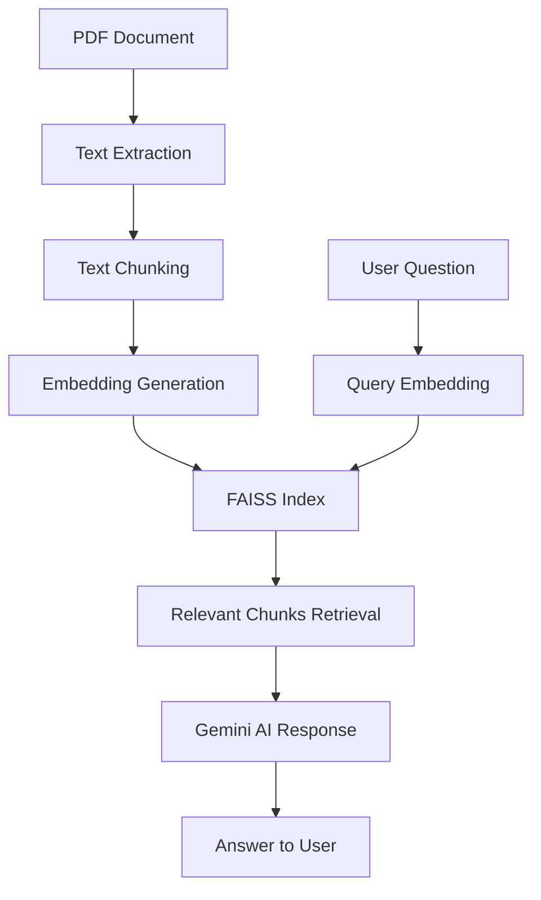

# 📄 Document QA with Google Gemini

**An intelligent document question-answering system that uses RAG (Retrieval-Augmented Generation) to provide accurate answers from uploaded PDF documents.**

## 📋 Prerequisites

- Python 3.8 or higher
- Google Gemini API key ([Get it here](https://aistudio.google.com/))

## 🚀 Quick Installation

### 1. Create Project Directory
```bash
mkdir document-qa
cd document-qa
```
### 2. Set Up Virtual Environment
```bash
python -m venv venv

# Activate on Mac/Linux:
source venv/bin/activate
```
### 3. Install Dependencies
```bash
pip install -r requirements.txt
```
### 4. Configure Environment
- Create a .env file:
```bash
GEMINI_API_KEY=your_actual_gemini_api_key_here
```
### 5. Running the Application
- Save the code and run:
```bash
streamlit run <filename>
```
### Access the Interface
- The terminal will display a local URL (typically http://localhost:8501)
- Open this URL in your web browser
- Upload PDF documents and start asking questions!
  
## 📈 System Architecture

# 🧠 Document QA System

A context-aware document question-answering system powered by **LangChain**, **FAISS**, and **Google Gemini 2.5 Flash**, with an interactive **Streamlit** interface.

---


## 🔧 Core Components

### 1. Document Processing
- 📄 PDF text extraction using **PyPDF2**  
- ✂️ Intelligent text chunking with overlap  
- ⚙️ Handles large documents efficiently  

### 2. Embedding & Vector Store
- 🧩 Text embeddings with **SentenceTransformer**  
- 🔍 **FAISS** for fast similarity search  
- ⚡ Efficient vector indexing and retrieval  

### 3. AI Integration
- 🤖 **Google Gemini 2.5 Flash** for response generation  
- 🧠 Context-aware prompt engineering  
- ✅ Accurate answers from document context  

### 4. Web Interface (Streamlit)
- 🪶 Simple document upload interface  
- 💬 Real-time question answering  
- 🧭 Clean and responsive design  

---

## ⚡ Key Features
- 🧠 **Document Intelligence** — Extract and process information from PDFs  
- 🔎 **Semantic Search** — Find relevant content using vector similarity  
- 🗣️ **Context-Aware Answers** — Generate accurate responses based on document content  
- 🚀 **Fast Retrieval** — FAISS enables quick similarity searches  
- 🧍‍♂️ **User-Friendly** — Simple upload and query interface  

---

## 📊 What It Does
The **Document QA System** acts as a **smart research assistant** that can:
- Process and understand brand manuals and campaign documents  
- Answer specific questions about uploaded content  
- Retrieve relevant information using semantic search  
- Provide accurate, context-based answers  
- Handle documents like contracts, briefs, and guidelines  

> 💡 The system combines **document processing**, **vector search**, and **AI generation** to deliver precise answers from your documents.
