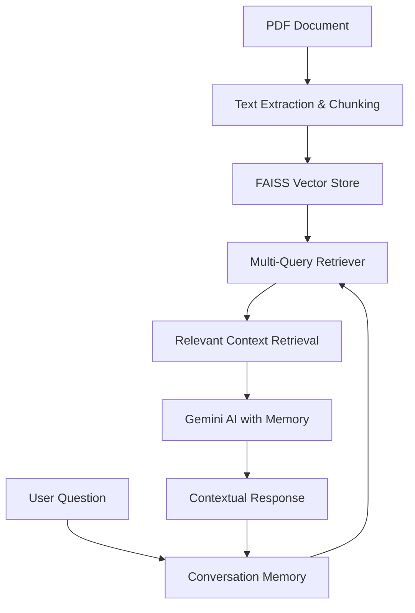

# 💬 Campaign Data QA Bot

**An advanced conversational AI system with memory that enables interactive Q&A sessions about marketing campaign documents with contextual understanding.**

## 📋 Prerequisites

- Python 3.8 or higher
- Google Gemini API key ([Get it here](https://aistudio.google.com/))

## 🚀 Quick Installation

### 1. Create Project Directory
```bash
mkdir campaign-qa-bot
cd campaign-qa-bot
```
### 2. Set Up Virtual Environment
```bash
python -m venv venv

# Activate on Mac/Linux:
source venv/bin/activate
```
### 3. Install Dependencies
```bash
pip install -r requirements.txt
```
### 4. Configure Environment
- Create a .env file:
```bash
GEMINI_API_KEY=your_actual_gemini_api_key_here
```
### 5. Running the Application
- Save the code and run:
```bash
streamlit run <filename>
```
### Access the Interface
- The terminal will display a local URL (typically http://localhost:8501)
- Open this URL in your web browser
- Upload campaign PDFs and start conversational Q&A!
## 📈 System Architecture


## 🔧 Core Components

### 1. Advanced Document Processing
- 📄 PDF text extraction using **PyPDF2**  
- ✂️ Intelligent text chunking with configurable overlap  
- 🧱 **LangChain** document structuring for RAG  

### 2. Multi-Query Retrieval System
- 🔁 Automatically generates multiple query variations  
- 🎯 Enhances search relevance through query expansion  
- 🧩 Retrieves diverse contextual information  

### 3. Conversational Memory
- 💬 **ConversationBufferMemory** maintains chat history  
- 🧠 Enables follow-up questions and contextual understanding  
- 🔒 Preserves conversation context across interactions  

### 4. Intelligent Vector Search
- ⚡ **FAISS** for fast similarity search  
- 🧩 **HuggingFace** embeddings for semantic understanding  
- 🧭 Efficient retrieval of relevant document sections  

### 5. Streamlit Chat Interface
- 🪶 Interactive chat-style interface  
- 💬 Real-time conversation display  
- 🧾 Session-based memory management  

---

## ⚡ Key Features
- 🧠 **Conversational Memory** — Remembers previous questions and answers for contextual follow-ups  
- 🤖 **Multi-Query Intelligence** — Automatically reformulates queries for better retrieval  
- 📘 **Document Understanding** — Deep comprehension of campaign briefs and marketing materials  
- 🗣️ **Contextual Responses** — Provides answers that build on previous conversation  
- 📊 **Comparative Analysis** — Can contrast different campaigns based on conversation history  

---

## 📊 What It Does
The **Campaign QA Bot** acts as an **intelligent marketing analyst** that can:

- Process and understand complex campaign documents  
- Answer questions with contextual awareness of previous conversations  
- Compare different campaigns based on budget, goals, and performance  
- Handle multi-step analytical requests  
- Provide insights that build upon earlier discussions  

> 💡 The system combines **advanced RAG techniques** with **conversational memory** to create a truly interactive document analysis experience that understands context and maintains conversation flow.

---
