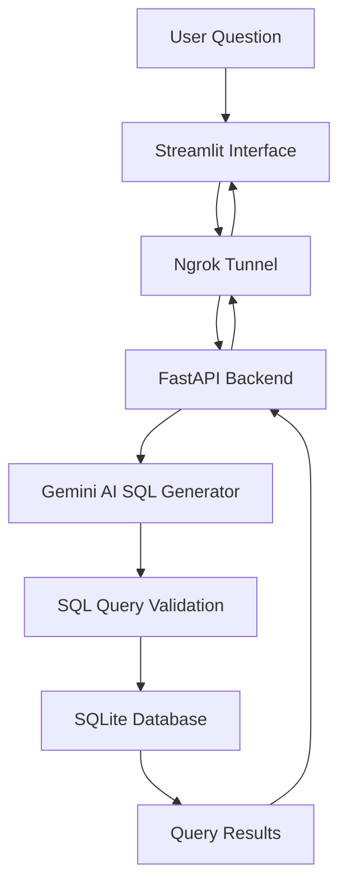

# 📊 SQL QA System for Marketing Analytics

**An intelligent natural language to SQL query system that allows marketers to ask business questions in plain English and get data-driven insights from campaign databases.**

## 📋 Prerequisites

- Python 3.8 or higher
- Google Gemini API key ([Get it here](https://aistudio.google.com/))
- Ngrok account ([Sign up here](https://ngrok.com/))

## 🚀 Quick Installation

### 1. Create Project Directory
```bash
mkdir sql-qa-system
cd sql-qa-system
```
### 2. Set Up Virtual Environment
```bash
python -m venv venv

# Activate on Mac/Linux:
source venv/bin/activate

# Activate on Windows:
venv\Scripts\activate
```
### 3. Install Dependencies
```bash
pip install -r requirements.txt
```
### 4. Install Ngrok
```bash
# On Windows
choco install ngrok

# On Mac
brew install ngrok

# Or download from https://ngrok.com/download
```
### 5. Configure Environment
- Create a .env file:
```bash
GEMINI_API_KEY=your_actual_gemini_api_key_here
LOCAL_API_URL=http://localhost:8000
DB_PATH=portfolio.db
NGROK_AUTH_TOKEN=your_ngrok_auth_token_here
```
### 6. Authenticate Ngrok
```bash
ngrok authtoken your_ngrok_auth_token_here
```
### 🏃‍♂️ Running the Application (Cmd )
- Go to file location using cd <file name>
- Start virtual enviroment 
```bash
start uvicorn sql_qa_system:app --reload --host 127.0.0.1 --port 8000
streamlit run streamlit_app.py
```
### Access the Interfaces
- Streamlit Local: http://localhost:8501
- Open Streamlit URL in your browser to start querying!

## 🔧 Core Components

### 1. Database Schema
- 🗂️ **Campaigns Table** — Contains client campaign details such as spend, ROI, and channel data  
- 👥 **Customers Table** — Stores customer demographics, loyalty scores, and churn risk  
- 📈 **Leads Table** — Tracks lead status and conversion probabilities linked to campaigns  

---

### 2. AI-Powered SQL Generation
- 🤖 **Google Gemini 2.5 Flash** for natural language → SQL query generation  
- 🧠 Schema-aware **prompt engineering** for accurate query formation  
- 🔒 Safety filters to prevent malicious SQL injection or unauthorized access  

---

### 3. Backend API (FastAPI)
- ⚙️ **RESTful API** for SQL generation and execution  
- ✅ Input validation and error handling for robustness  
- 🌐 **CORS-enabled** for seamless frontend integration  

---

### 4. Web Interface (Streamlit)
- 🪶 **User-friendly query interface** for marketers and analysts  
- 💬 Pre-built **sample questions** for quick exploration  
- ⚡ Real-time **query results** displayed in an interactive table  
- 👁️ **SQL preview and execution metrics** for transparency and debugging  

---

## ⚡ Key Features

- 💬 **Natural Language Queries** — Ask business questions in plain English  
- ⚙️ **Automatic SQL Generation** — AI converts questions to optimized SQL queries  
- 🌍 **Public Access** — Ngrok enables external access to local API endpoints  
- 🧱 **Safety First** — Built-in protection against SQL injection and harmful queries  
- 📊 **Sample Dataset** — Pre-loaded with realistic marketing data  
- 🚀 **Real-time Results** — Instant query execution and dynamic visualization  

---

## 📊 Sample Questions You Can Ask

- “Show top 5 campaigns by ROI in the last 6 months.”  
- “Which channels drive the most conversions for high-spend campaigns?”  
- “Find urban customers with high loyalty scores but high churn risk.”  
- “Compare lead conversion rates across different campaign channels.”  
- “Calculate ROI trends by region and customer segment.”  
