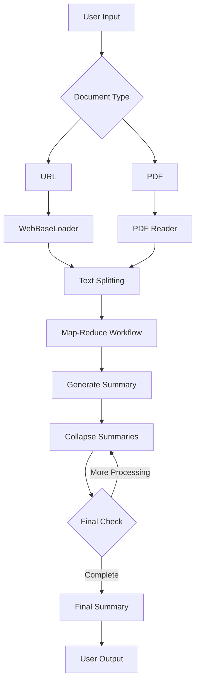

# 📄 Document Loader & Summarizer

**An intelligent document processing system that uses advanced AI workflows to summarize large documents from URLs and PDFs with customizable objectives.**

## 📋 Prerequisites

- Python 3.8 or higher
- Google Gemini API key ([Get it here](https://aistudio.google.com/))

## 🚀 Quick Installation

### 1. Create Project Directory
```bash
mkdir document-summarizer
cd document-summarizer
```
### 2. Set Up Virtual Environment
```bash
python -m venv venv

# Activate on Mac/Linux:
source venv/bin/activate

# Activate on Windows:
venv\Scripts\activate
```
### 3. Install Dependencies
```bash
pip install -r requirements.txt
```
### 4. Configure Environment
- Create a .env file:
```bash
GEMINI_API_KEY=your_actual_gemini_api_key_here
```
### 🏃‍♂️ Running the Application
- Launch Streamlit Application
```bash
streamlit run your_filename.py
```
### Access the Interface
- Open http://localhost:8501 in your browser
- Start summarizing documents immediately!

## 🔧 Core Components

### 1. Document Loading
- 🌐 **URL Support** — Extracts content from web pages using **WebBaseLoader**  
- 📄 **PDF Support** — Processes multiple PDF files using **PyPDF2**  
- 🔁 **Multi-format Handling** — Supports both online and offline document sources  

---

### 2. Advanced Text Processing
- ✂️ **CharacterTextSplitter** for optimal chunking  
- 🧮 **Token-based length calculation** for LLM compatibility  
- 🧩 Intelligent document splitting with **overlap management**  

---

### 3. LangGraph Workflow Engine
- 🗺️ **Map-Reduce architecture** for processing large documents  
- ⚖️ Conditional processing based on content length  
- 🔄 Automatic recursion for **complex summarization tasks**  

---

### 4. AI-Powered Summarization
- 🤖 **Google Gemini 2.5 Flash** for high-quality, context-aware summaries  
- 🎯 Customizable summarization objectives (e.g., "Top 5 customer concerns")  
- 🔁 Retry mechanism for API quota management and reliability  

---

### 5. Streamlit Interface
- 🪶 **User-friendly document upload and URL input**  
- 🧠 **Real-time workflow visualization** of summarization steps  
- 🎛️ Interactive controls for customization and output preferences  

---

## ⚡ Key Features

- 📂 **Multi-Source Input** — Process both URLs and PDF documents  
- 🎯 **Custom Objectives** — Define exactly what to summarize (e.g., “top 5 customer concerns”)  
- 🗺️ **Map-Reduce Architecture** — Efficiently handles large documents through distributed processing  
- 👁️ **Visual Workflow** — View the summarization process as a dynamic graph  
- 🧱 **Error Resilience** — Automatic retries for API quota or connectivity issues  
- ⚡ **Real-Time Progress** — Observe summarization in action through the Streamlit interface  

---

## 📊 Workflow Process

### **Phase 1: Document Loading**
- Extract text from URLs or PDFs  
- Split into manageable chunks  
- Prepare data for AI summarization  

---

### **Phase 2: Map-Reduce Summarization**
- 🗺️ **Map Step:** Generate individual summaries for each chunk  
- 🧩 **Reduce Step:** Combine summaries into cohesive themes  
- 🌀 **Collapse Step:** Refine and condense until the optimal summary length is achieved  

---

### **Phase 3: Final Output**
- 🧾 Consolidated summary based on user objectives  
- 🪶 Clean, readable format  
- 📚 Structured around specified themes or key insights  

