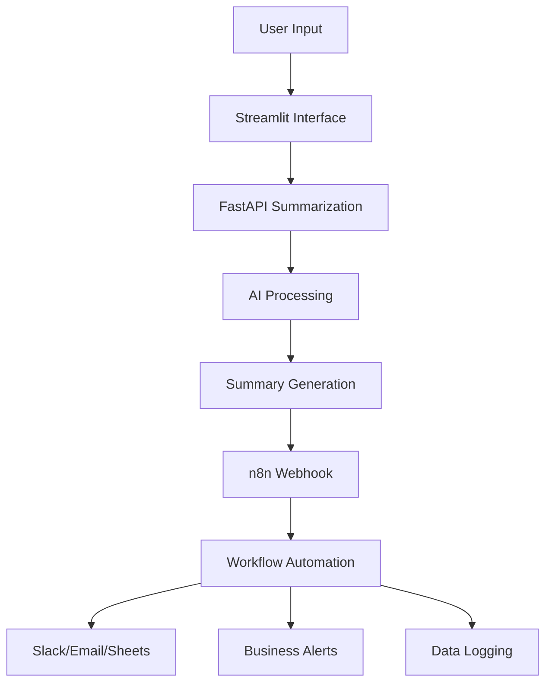

# 🤖 Workflow Automation with n8n

**An integrated automation system that connects AI-powered document summarization with n8n workflows for intelligent business process automation.**

## 📋 Prerequisites

- Python 3.8 or higher
- Google Gemini API key ([Get it here](https://aistudio.google.com/))
- n8n account ([Sign up here](https://n8n.io/))
- Ngrok for webhook tunneling
- Docker for N8N
- 
## 🚀 Complete Setup Guide

### 1. Project Structure Setup

#### Navigate to Project Directory
```bash
cd C:\Users\hi\Downloads\finwise-genai-capstone\
```
#### Create Virtual Environment
```bash
python -m venv .venv
```
#### Activate Virtual Environment
```bash
# Windows
.venv\Scripts\activate

# Mac/Linux
source .venv/bin/activate
```
#### Install Dependencies
```bash
pip install -r requirements.txt
```
### 🏃‍♂️ Running the System
- Run all the componenet in different cmd in window
- go to the project file in cmd in window
  
#### Component 1: FastAPI Summarization Server
- Start the Summarization API
```bash
# Navigate to task-6 directory
cd task-6

# Launch FastAPI server
uvicorn summarization_api:app --reload
```
- Access: http://127.0.0.1:8000
#### Component 2: Streamlit Interface
- Start the Web Interface
```bash
# Navigate to task-8 directory
cd task-8

# Launch Streamlit application
streamlit run n8n.py
```
- Access: http://localhost:8501

- For further setup visit this youtube video: 
- https://youtu.be/RvAD2__YYjg?si=H_Zkl1M8rLFZSvcM
  
#### Component 3: Ngrok Setup for Webhooks
- Download and Setup Ngrok
- Download ngrok from ngrok.com/download

- Unzip to C:\Users\hi\Downloads\ngrok-v3-stable-windows-amd64\

- Authenticate Ngrok (One Time)
```bash
cd C:\Users\hi\Downloads\ngrok-v3-stable-windows-amd64
ngrok config add-authtoken YOUR_AUTH_TOKEN
```
- Start Ngrok Tunnel
```bash
ngrok http --url=your-custom-subdomain.ngrok.io 5678
```


#### 🔧 System Architecture


## Core Components

### 1. FastAPI Summarization Backend
- RESTful API for document processing
- Supports text, PDF, and URL inputs
- Google Gemini AI integration
- Map-reduce summarization workflow

### 2. Streamlit Frontend Interface
- User-friendly document upload
- Real-time summarization
- n8n integration controls
- Summary preview and management

### 3. n8n Workflow Automation
- Webhook triggers from summaries
- Multi-channel notifications
- Data logging and analysis
- Business rule enforcement

### 4. Ngrok Tunneling
- Secure webhook exposure
- Public URL for n8n callbacks
- Local development support

---

## 🛠️ Usage Workflow

### Step 1: Document Processing
1. Open Streamlit interface at [http://localhost:8501](http://localhost:8501)
2. Select input type (Text, PDF, or URL)
3. Enter summarization objective
4. Generate AI-powered summary

### Step 2: Automation Trigger
1. Click **"Send Summary to n8n"**
2. Summary data is sent to n8n webhook
3. n8n workflow processes the data
4. Automated actions executed based on content

---

## 📊 n8n Automation Examples

### Marketing Campaign Alerts
- **Trigger:** Campaign ROI below 2.0  
- **Action:** Send Slack notification to marketing team  
- **Data Source:** SQL query results from campaign database  

### Customer Retention Automation
- **Trigger:** VIP customer churn risk > 70%  
- **Action:** Email account manager with customer details  
- **Data Source:** Customer database analysis  

### Sentiment Analysis Workflow
- **Trigger:** Negative sentiment detected in summaries  
- **Action:** Create support ticket and notify customer service  
- **Data Source:** Document summarization output  

### Data Logging Automation
- **Trigger:** Any chatbot query processed  
- **Action:** Log to Google Sheets for trend analysis  
- **Data Source:** Chatbot conversation history  

---

## 🔌 API Endpoints

### FastAPI Endpoints
- `POST /summarize_json` - Text summarization  
- `POST /summarize` - PDF/URL summarization  
- Webhook ready for n8n integration  

### n8n Webhook Configuration
- **URL:** `https://your-subdomain.ngrok.io/webhook-test/streamlit-input`  
- **Method:** POST  
- **Payload:** JSON with input and summary data  

---

## 🎯 Business Use Cases

### Real-time Campaign Monitoring
- Automatic ROI threshold alerts  
- Performance trend analysis  
- Competitor response tracking  

### Customer Experience Management
- Proactive churn prevention  
- Sentiment-based escalations  
- Personalized follow-up automation  

### Operational Efficiency
- Automated report distribution  
- Data quality monitoring  
- Cross-team collaboration triggers  

---

## ⚠️ Troubleshooting

### Common Issues & Solutions

#### n8n Connection Failed
- Verify ngrok tunnel is active  
- Check webhook URL in Streamlit configuration  
- Confirm n8n workflow is published  

#### FastAPI Server Not Responding
- Ensure virtual environment is activated  
- Check if port 8000 is available  
- Verify all dependencies are installed  

#### Ngrok Tunnel Issues
- Renew authentication token if expired  
- Check firewall settings  
- Verify custom subdomain availability  
